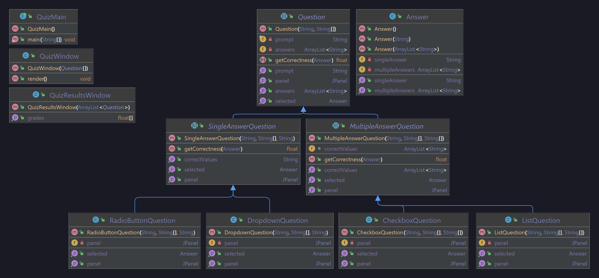

# A02_QuizGUI

### Problem Statement
Create a quiz using GUI for students in an elementary school using any material you like. In this problem you are required to have at least 5 questions using the following different GUI components: checkboxes, radio buttons, dropdown box, and lists. Each question should have at least 4 choices. To make sure that the students did not cheat, add a statement verifying that the above answers are their own work at the bottom of the quiz. Ask them to sign the statement by checking an Acknowledgement box. Provide a submit button for the quiz. Student cannot submit the quiz without signing the statement. Once they click Submit, your program should present a summary of the quiz showing all of the graded questions (correct/incorrect/unanswered). The summary should also include their score on the quiz. 

### Developer Documentation
Questions can easily be added to the quiz by modifying the static Question[] array in the main class. The constructor for each question takes in a String prompt, a String[] array of possible answers, and either a String correct answer or a String[] array of correct answers (depending on if its a single or multiple answer question).

Creating your own type of question is as simple as creating a class that extends `SingleAnswerQuestion` or `MultipleAnswerQuestion`. To do this, you must override two abstract methods;
- `getPanel`, which returns a JPanel that can be placed within the JFrame of the main window.
- `getSelected`, which returns an Answer object that represents the solution the user chose for the question.

Answers are assessed by the super class in order to determine a float score (∈ [0, 1]).

### User Documentation
Simply run the main class and take the quiz; when you're finished, verify you didn't cheat by checking the box and submit the quiz to get your score.

#### UML Diagram

