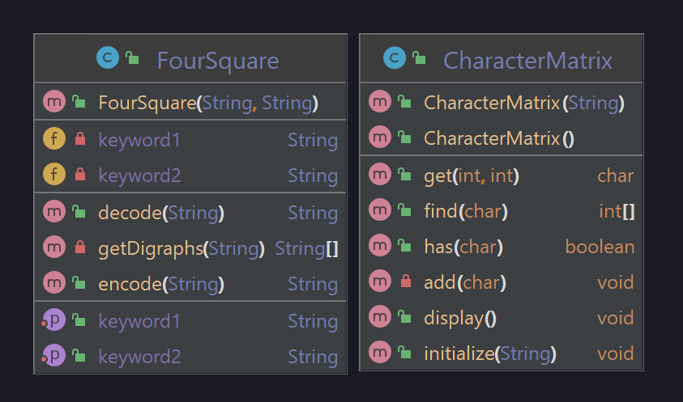

# A14_FourSquare

### Problem Statement
The Four-Square Cipher is a cipher that takes in two keywords or key phrases and a text to be encoded. The program will take in these variables and produce a matrix of four squares that have the message encoded.

### Developer Documentation
The FourSquare class is what you should be using to actually encode and decode the data. It does so via a grid of CharacterMatrix's which contain the matrices that actually encode the data. If needed, you can change the keywords of the cipher, however doing so will require rebuilding of the matrices (which is done automatically).

### User Documentation
To see the class function, use junit to run the tests located in the test directory.

#### UML Diagram

