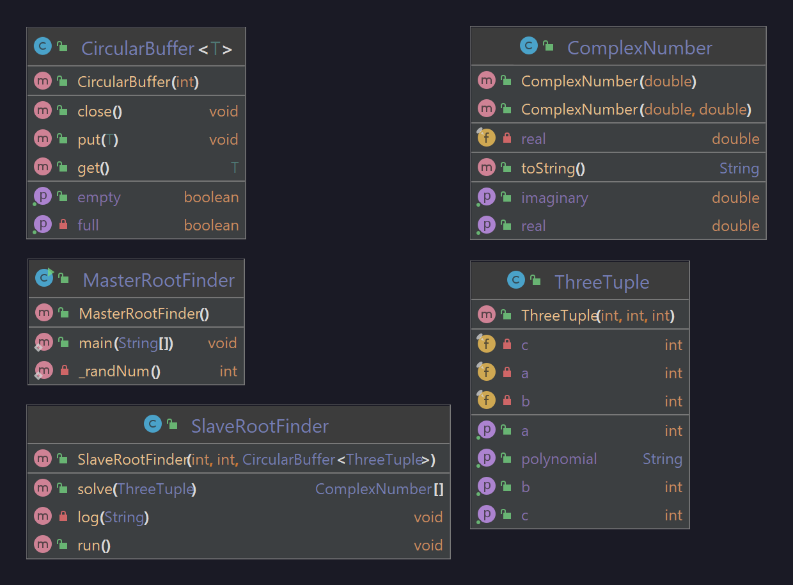

# A05_MultithreadingRootFinder

### Problem Statement
This is a master/slave multi-threading problem, with the goal of finding the roots of a quadratic equation.

Generally there are two classes necessary for this problem; the MasterRootFinder class and the SlaveRootFinder class. The master will create slaves and the slaves will find the roots of randomly generated polynomial 3-tuples in their own threads. 3-tuples will be distributed to the threads in a data structure called a CircularBuffer which is passed to the slave classes - the size of this buffer is only 10. The results should go into another buffer (which can be as big as we want), with information being displayed to the console when all is finished.

The test program should allow the user to generate and solve 30 sets of polynomials, or 3000. For the former, the console should output the polynomials and their respective roots; for the latter, some statistics of how many polynomials each thread encountered and some other data that may be interesting to include.

### Developer Documentation
All root-finding logic is in the SlaveRootFinder.java file.

The solution works because of the synchronized nature of the CircularBuffer class, allowing only one thread to grab a polynomial at a time. The polynomial is put into a method that solves it, returning an array of two ComplexNumbers which are the roots. These are put into another CircularBuffer which determines how many real and imaginary solutions are present for each thread.

After the 30 (or 3000) polynomials are inserted into the buffer, it is *closed* and no new values are allowed to be inserted. The threads no longer wait when the buffer is empty, instead returning `null` which is handled as a end code.

### User Documentation
Simply run the main method to see it work in action.

#### UML Diagram

