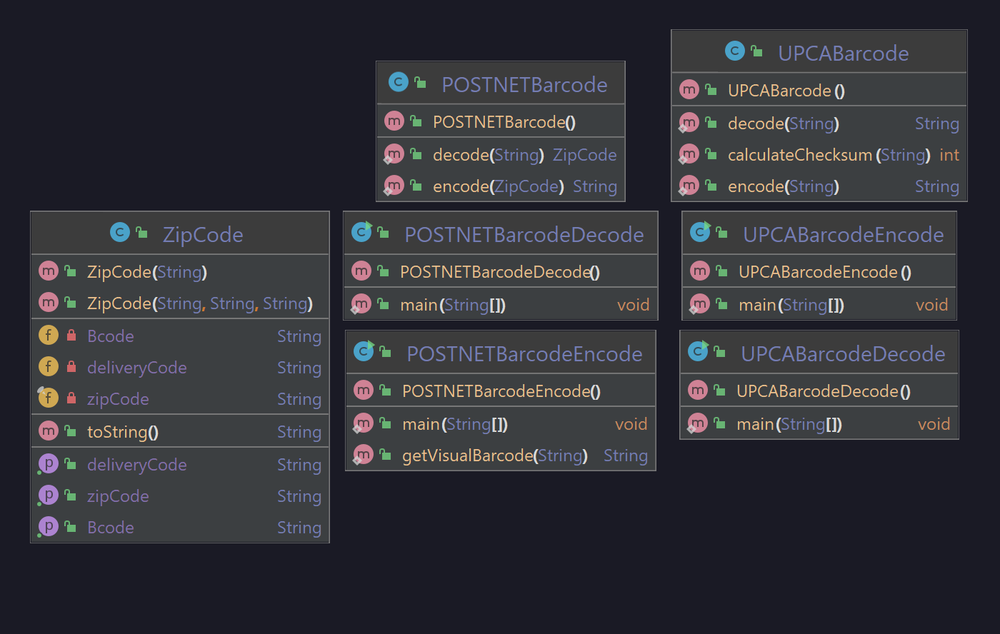

# A15_Barcodes

### Problem Statement
You will build programs to create two different types of barcodes.
- **POSTNET:** The barcode used by the post office to automatically sort mail.
- **UPC:** The barcode used to buy a pack of gum at CVS, for example.

You must complete both encodings.

Both encodings should include their own class to encode and decode their messages, as well as a "demonstration" test class that allows the user to put in a zipcode/UPC and output a barcode (in binary format), as well as go the other way. Per the original instructions, we should be able to "round trip" the barcodes via a copy-and-paste operation.

For the POSTNET barcode, additionally include a visual representation using the '|' and '.' characters.

### Developer Documentation
The program is made up of just four methods; encode and decode static methods for each encoding, in two classes. Note that the POSTNET encoding method takes in a ZipCode object, and the decoding method also *returns* a ZipCode object which it parsed from the barcode.

### User Documentation
Simply run the correct program for your use case; the barcode you're working with, and whether you're looking to encode or decode. Insert it into the console when told, and out will come your result (or an error code, if you're misusing it).

#### UML Diagram

