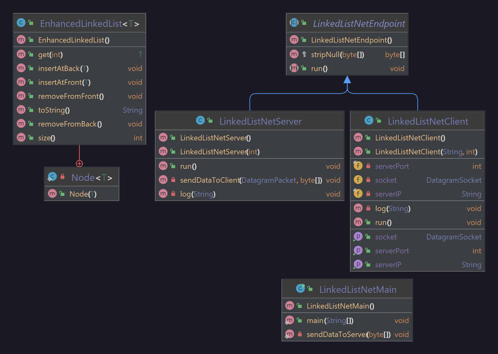

# B06_LinkedListNet

### Problem Statement
This is a networking problem; we must maintain a linked list on the server side, and have clients make changes to it on their side.

The linked list should have a few other methods on top of its typical methods; `insertAtFront`, `insertAtBack`, `removeFromFront`, and `removeFromBack`. There should be a Client and Server class that handles packets coming from the opposite side. The client should have a few options to interact with the servers linked list; insert an element, remove an element, display the list, and disconnect. The client should send the data necessary for the server to deal with it, and the server should be able to parse these packets and interact with the list.

### Developer Documentation
The main class creates a client and a server in their own threads, and allows you to input commands to the client through the main method. The console will display these commands being sent to the server, and a response being sent back to the client, which it'll then print to the console.

Each packet starts out with an "opcode" byte that tells the other side some information of what its trying to do; on the client side, this can be any command you're trying to send, and on the server side, its simply set to a 0 if it executed successfully, or a 1 if some issue occurred.

From there, the rest of the packet can be arbitrary data. All data sent to the server are whatever the server needs to execute them; all data sent back to the client is a *string* response.

### User Documentation
Simply run the main class; this will create a client/server structure and you'll be able to interact with the server from the client.

#### UML Diagram

