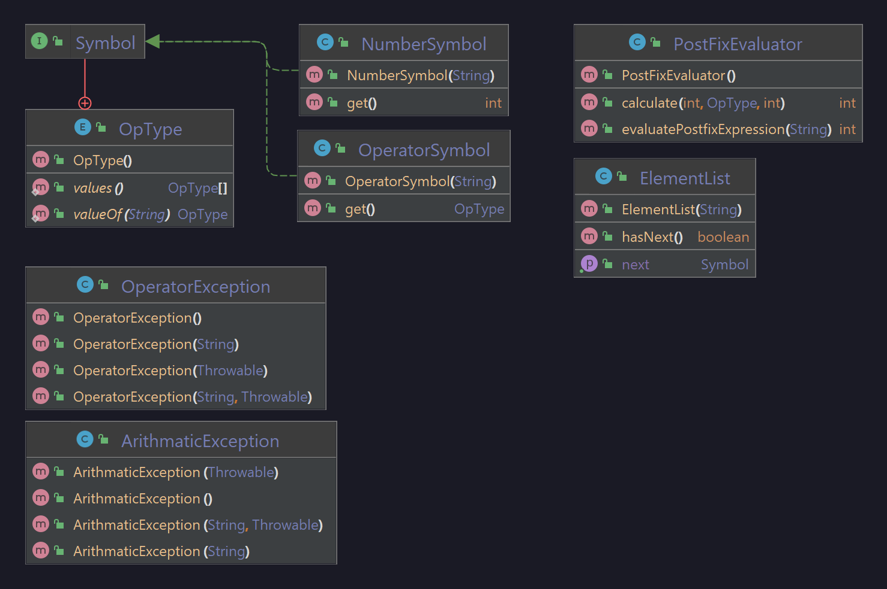

# B08_21 13_PostFixEval

### Problem Statement
Create a postfix evaluator class that can handle 6 different operators (`+`, `-`, `*`, `/`, `^`, and `%`) as well as numbers of any size.

### Developer Documentation
To use it, simply create an instance of the PostFixEvaluator class and invoke the method `evaluatePostfixExpression`.

Upon evaluation, the values of the equation will be "symbolized" and put into a list in which they're handled one at a time. The program can detect if it tries to do something wrong (i.e. divide by 0) and throw an exception if it does.

### User Documentation
Simply run the tests found in the `test/` directory to see it in action.

#### UML Diagram

