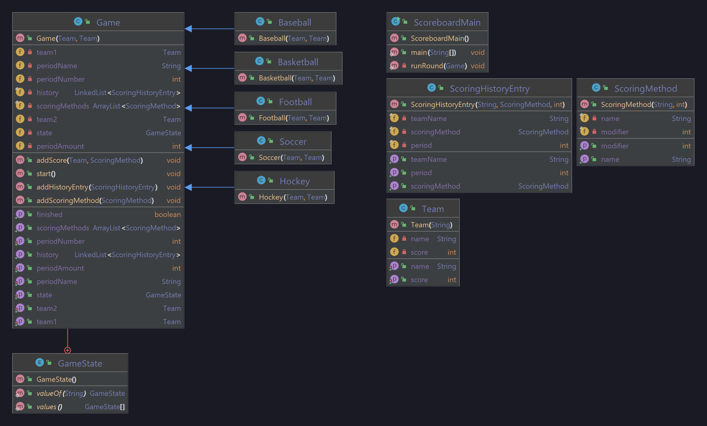

# B11_Scoreboard

### Problem Statement
Design a software scoreboard system that can handle a wide variety of sports. Include functionality that does a number of things, including;
- Get + set team names.
- Get + set team scores.
- Get scoring methods.
- Start the game.
- Get period information, such as name, amount, and current period of play.
- End the current period of play.
- Determine if the game is over.
- Determine winning team, and play a replay of all the plays that occurred.

Next, construct a command line interface that allows you to interactively start and keep score of various different types of games (baseball, football, etc).

### Developer Documentation
The Game class holds all the *general* game information, and is easily extendable to other different games which hold some specific game information such as scoring methods.

### User Documentation
Simply run the main method, input the game type and teams you're playing, and start the simulation.

#### UML Diagram

