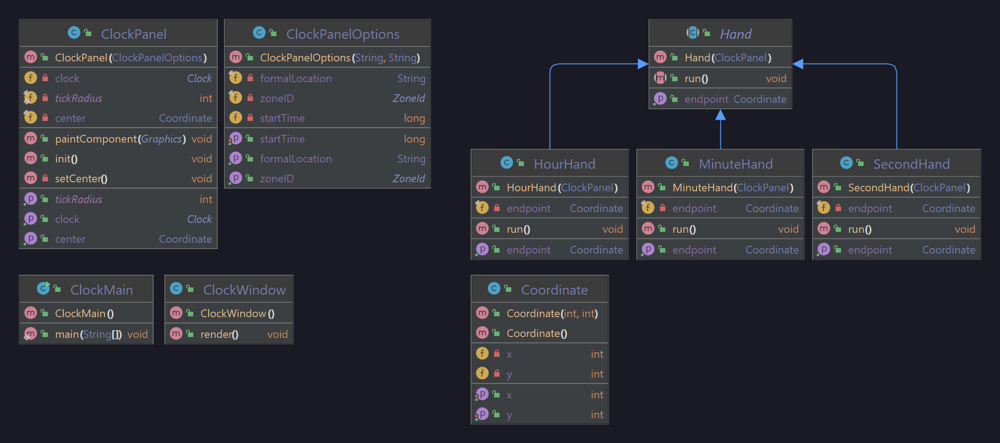

# B13_Clock

### Problem Statement
Create an xclock-like GUI that displays the time as well as the current date, your timezone, and location.

Each clock hand should run in its own thread. Upon starting the application, the clock must be hard coded to start in Iowa City, IA (CST, or UTC-6) at Sunday, March 13, 2022 @ 1:59:55 AM.

Then, display 10 clocks started at the current time, displaying 10 different time zones.

### Developer Documentation
Each clock is its own JPanel, which can be placed wherever JPanels are placed. As they are entirely rendered in java (no external assets :D), the clocks are extensible; you can change the length of the hands or the radius of the clock ticks and whatnot.

### User Documentation
To see the original prompt, start the test application in the test folder.

To see the latter prompt, start the ClockMain application in the src folder.

#### UML Diagram

